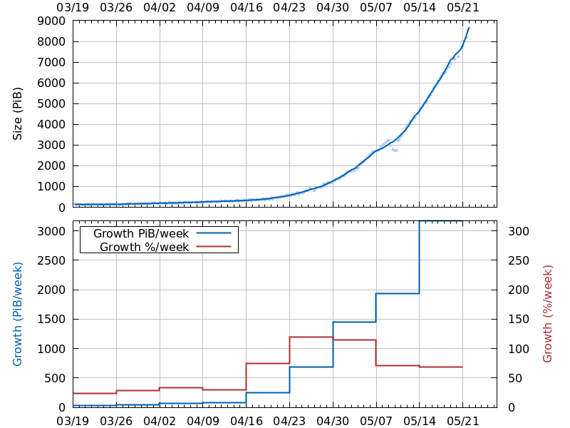

# Plotting the graph

Create netspace.json from this graph:
https://www.chiaexplorer.com/charts/netspace

Open developer tools, look at the request to api2.chiaexplorer.com,
which retrieves the graph data. Copy the response into netspace.json.

Then run ./plot, which:

      netspace.json
      |
    json_to_tsv.py # also processes data, e.g. adds columns like smoothed curve
      |
      netspace.tsv  netspace.plot
      |            /
    gnuplot-------/
      |
      netspace.svg

Which results in:

